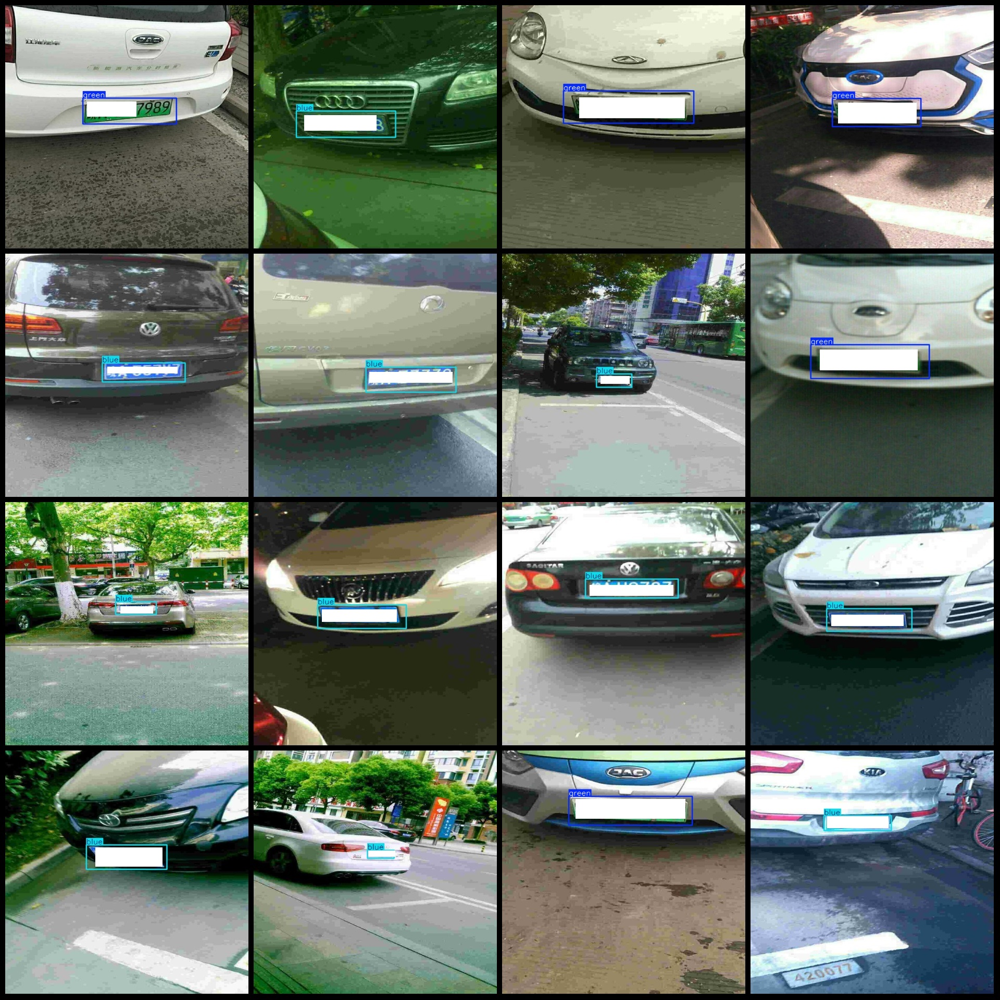
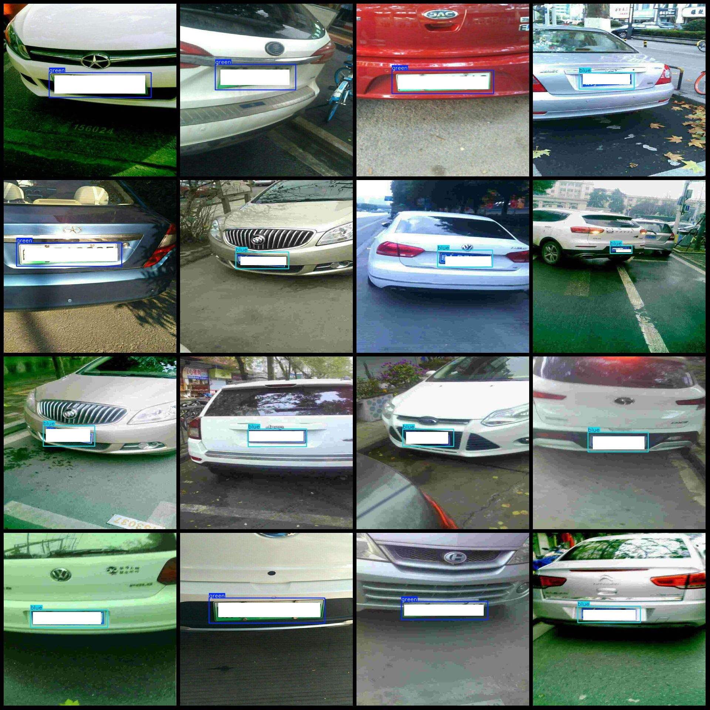

# Domestic Vehicle License Plates, Blue and Green Labels for New Energy and Oil Cars Detection Dataset in VOC+YOLO Format with 3509 Images in 2 Categories

Dataset format: Pascal VOC format + YOLO format (txt file without split path, only containing jpg images along with corresponding VOC format xml files and YOLO format txt files)
Number of image files (jpg): 3509
Number of annotation files (xml): 3509
Number of annotation files (txt): 3509
Number of categories: 2
Annotation category names (note that the order of categories in the YOLO format does not correspond to this, and is based on the labels folder classes.txt): ["blue", "green"]
Each category has a number of bounding boxes:
Blue boxes = 2518
Green boxes = 1003
Total bounding boxes = 3521
Each category occupies a number of images:
Blue occupies images = 2508
Green occupies images = 1001
Image resolution: 640x640
Using annotator tool: labelImg
Annotation rule: draw bounding boxes for categories
Important note: The dataset does not have separate training, validation, or test sets; users must divide them themselves.
Special declaration: This dataset does not guarantee the accuracy of the trained model or weight files.
Preview of images without obstructions:
Example of annotation (without obstructions):

## Images

Here is a pay link on Stripe ( https://buy.stripe.com/3cs8yP7sY87d0vu9AB ). Please contact me lonlonago@foxmail.com after funding $89, and I will send you a complete data files , thank you!

